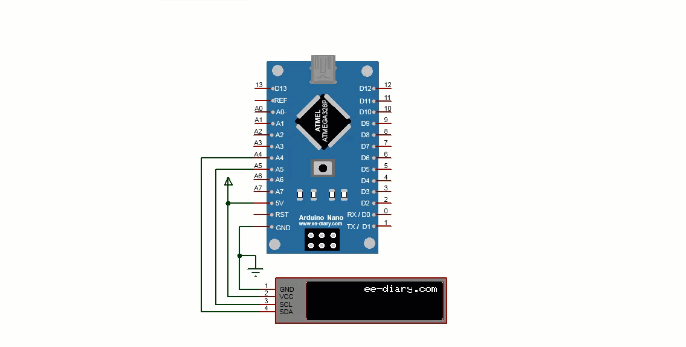

#  PomodoroNano
Arduino Nano 33 IOT based pomodoro timer. 

## Demo
Please find attach demo of the project:
https://youtu.be/D5Yah-L7upg

## Used hardware:
 - Arduino Nano 3.3 Iot
 - LCD 16x2 I2C 
 - cables to wire pins 

## Wiring 
Connect pins as follows: 



## Running 

1. [Install PlatformIO Core](https://docs.platformio.org/page/core.html)
2. Download [development platform with examples](https://github.com/platformio/platform-atmelsam/archive/develop.zip)
3. Extract ZIP archive
4. Run these commands:

```shell
# Build project
$ pio run

# Upload firmware
$ pio run --target upload

# Build specific environment
$ pio run -e due

# Upload firmware for the specific environment
$ pio run -e due --target upload

# Clean build files
$ pio run --target clean
```

## Other remarks 
If you have issues uploading software onto microcontroller, first check 
if your cable is capable of transmitting data. Second, double tap the reset 
button while uploading to reset the bootloader. this might help because for some reason pio doesn't wait long enough after it sends a signal to bootloader to reset, so it reports error that it couldn't find any device on a given port. 
